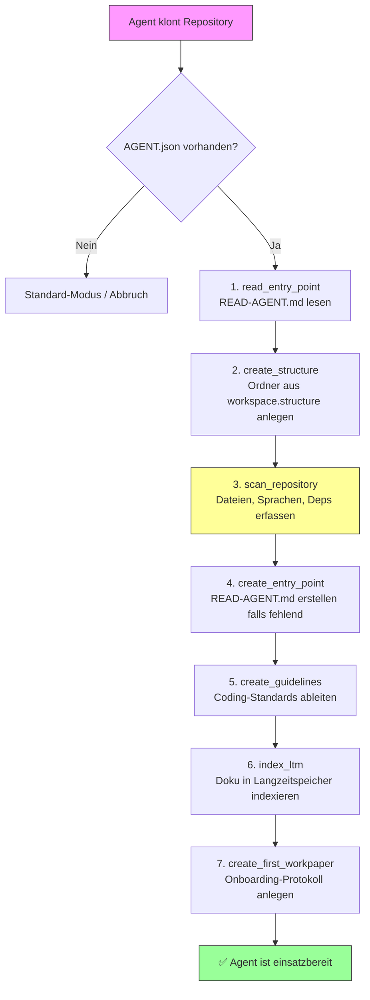

# AAMS — Autonomous Agent Manifest Specification
## Version 1.0 · local-first · 2026-02-18

> **Repository:** https://github.com/aams-spec/aams  
> **Status:** Draft  
> **Maintainer:** open — contributions welcome  

---
 
## Warum AAMS?

Jedes Repository hat eine `README.md`. Sie erklärt Menschen, wie das Projekt funktioniert. Aber wenn ein KI-Agent dieses Repo klont, hat er nichts: keine Arbeitsstruktur, kein Gedächtnis, keine Regeln, keinen Einstiegspunkt.

Ohne Standard passiert das:

- **Kontextverlust** — Session 48 weiß nicht, was Session 47 entschieden hat
- **Doppelarbeit** — der Agent trifft dieselben Entscheidungen erneut
- **Verwaiste Dateien** — niemand räumt auf, was ein vergessener Arbeitsstrang hinterlassen hat
- **Keine Struktur** — Whitepapers, Workpapers, Logs landen irgendwo oder nirgends

**AAMS ist die Antwort:** Eine standardisierte, versionierbare, validierbare Manifest-Datei, die einem Agenten sagt: So arbeitest du in diesem Projekt.

```
README.md           → für Menschen
AGENT.json          → für Maschinen
READ-AGENT.md       → Einstiegspunkt für den Agenten
WORKING/            → Arbeitsstruktur (angelegt nach AGENT.json)
```

---

## Philosophie

- **Explicit over implicit** — alles was nicht erlaubt ist, ist verboten
- **Workspace-getrieben** — ein Agent bekommt eine definierte Arbeitsstruktur, nicht nur Regeln
- **Kontinuität** — Langzeitgedächtnis, Workpapers und Audit-Trails sichern den Kontext über Sessions hinweg
- **Local-first** — lokale Agenten zuerst; Cloud- und Mesh-Erweiterungen kommen in separaten Profilen
- **Maschinenlesbar** — JSON als Primärformat, validierbar per JSON-Schema
- **Versionierbar** — jede AGENT.json trägt `_spec: AAMS/1.0`
- **Erweiterbar** — Custom Skills und Tool-Registries sind möglich ohne den Kern zu brechen

---

## Compliance und Durchsetzung

AAMS definiert **was** ein Agent tun soll — erzwingen kann es jedoch keine Konformität. Ein Agent der `AGENT.json` ignoriert, hat keinerlei technische Konsequenz durch das Manifest selbst. Das ist inhärent bei jedem deklarativen Standard (`.editorconfig` hat dieselbe Einschränkung).

Es gibt jedoch bewährte Strategien um die Durchsetzungslücke zu schließen:

| Strategie | Beschreibung |
|-----------|-------------|
| **System-Prompt-Injektion** | Der Agent-Harness liest `AGENT.json` und injiziert die Regeln in den System-Prompt. Häufigster Ansatz für chat-basierte Agenten. |
| **Wrapper / Agent-Harness** | Eine übergeordnete Schicht fängt Agenten-Aktionen ab und validiert sie gegen `AGENT.json` vor der Ausführung. |
| **Pre/Post-Hooks** | CI/CD- oder Git-Hooks führen `aams-lint` vor Commits aus um Workpaper-Vollständigkeit und Code-Hygiene zu prüfen. |
| **Validator-Tooling** | `aams-validate` für Struktur-Compliance, `aams-lint --check-refs` für Pfad-Konsistenz. |
| **Audit-Trail-Review** | Das `session.audit_trail`-Log ermöglicht nachträgliche Erkennung von Verletzungen. |

> **Empfehlung für Implementierer:** Mindestens `AGENT.json`-Regeln in den System-Prompt injizieren und `aams-validate` in CI ausführen. Für höhere Vertrauensumgebungen: Agent-Harness mit Laufzeit-Berechtigungsprüfungen hinzufügen.

### Integrationspatterns (konkrete Beispiele)

#### Pattern 1: System-Prompt-Injektion

Der einfachste Ansatz. Der Orchestrator liest `AGENT.json` und injiziert relevante Regeln bei Session-Start in den System-Prompt des Agenten.

```python
# Beispiel: System-Prompt aus AGENT.json aufbauen
import json

def build_system_prompt(agent_json_path: str) -> str:
    with open(agent_json_path) as f:
        manifest = json.load(f)

    rules = []
    # Berechtigungen
    perms = manifest["permissions"]
    rules.append(f"Du darfst schreiben nach: {perms['filesystem'].get('write', [])}")
    rules.append(f"Verbotene Pfade: {perms['filesystem'].get('forbidden', [])}")
    rules.append(f"Shell-Ausführung: {'erlaubt' if perms['process'].get('shell_execution') else 'VERBOTEN'}")

    # Session-Hygiene
    session = manifest["session"]
    if session.get("create_workpaper"):
        rules.append(f"Erstelle ein Workpaper unter: {session['workpaper_path']}")
    rules.append("Protokolliere jede erstellte, geänderte oder gelöschte Datei im Workpaper-Dateiprotokoll.")

    # Code-Hygiene
    hygiene = manifest.get("workspace", {}).get("code_hygiene", {})
    if hygiene.get("no_commented_code"):
        rules.append("Niemals auskommentierten Code ohne Erklärung hinterlassen.")
    if hygiene.get("forbidden_patterns"):
        rules.append(f"Niemals Dateien mit diesen Mustern erstellen: {hygiene['forbidden_patterns']}")

    return "## Agent-Regeln (aus AGENT.json)\n" + "\n".join(f"- {r}" for r in rules)
```

#### Pattern 2: Agent-Harness mit Tool-Wrapping

Eine Middleware-Schicht die Tool-Aufrufe abfängt und sie gegen Berechtigungen validiert bevor sie ausgeführt werden.

```python
# Beispiel: Berechtigungsprüfender Wrapper für Dateisystem-Operationen
class AAMSHarness:
    def __init__(self, manifest: dict):
        self.fs_write = manifest["permissions"]["filesystem"].get("write", [])
        self.fs_forbidden = manifest["permissions"]["filesystem"].get("forbidden", [])
        self.shell_allowed = manifest["permissions"]["process"].get("shell_execution", False)

    def check_file_write(self, path: str) -> bool:
        """Gibt True zurück wenn der Agent an diesen Pfad schreiben darf."""
        for forbidden in self.fs_forbidden:
            if path.startswith(forbidden):
                raise PermissionError(f"AAMS: Schreiben nach '{path}' ist verboten")
        for allowed in self.fs_write:
            if path.startswith(allowed):
                return True
        raise PermissionError(f"AAMS: Schreiben nach '{path}' nicht in erlaubten Pfaden: {self.fs_write}")

    def check_shell(self, command: str) -> bool:
        if not self.shell_allowed:
            raise PermissionError(f"AAMS: Shell-Ausführung ist verboten. Blockiert: {command}")
        return True
```

#### Pattern 3: GitHub Action als Pre-Commit-Check

Eine CI/CD-Pipeline die Agenten-Output validiert bevor er den Hauptbranch erreicht.

```yaml
# .github/workflows/aams-check.yml
name: AAMS Compliance Check
on: [pull_request]
jobs:
  validate:
    runs-on: ubuntu-latest
    steps:
      - uses: actions/checkout@v4

      - name: AGENT.json Schema validieren
        run: |
          pip install check-jsonschema
          check-jsonschema --schemafile AGENT_SCHEMA.json AGENT.json

      - name: Workpaper-Vollständigkeit prüfen
        run: |
          for wp in WORKING/WORKPAPER/*.md; do
            [ -f "$wp" ] || continue
            for section in "Session Scope" "File Protocol" "Session Closing Checklist"; do
              grep -q "## .*$section" "$wp" || echo "::error file=$wp::Fehlender Abschnitt: $section"
            done
          done

      - name: Code-Hygiene prüfen
        run: |
          for pattern in "test-*" "debug-*" "temp-*" "*.tmp" "*.bak"; do
            found=$(find . -name "$pattern" -not -path "./node_modules/*" -not -path "./.git/*")
            [ -z "$found" ] || echo "::error::Verbotene Dateien gefunden: $found"
          done

      - name: Keine Secrets in Workpapers
        run: |
          grep -rn -E "(password|secret|token|api_key)\s*[:=]\s*['\"][^'\"]{8,}" WORKING/WORKPAPER/ \
            && echo "::error::Potenzielle Secrets in Workpapers gefunden" || true
```

AAMS schreibt keinen einzigen Durchsetzungsmechanismus vor — Implementierungen reichen von einfacher Prompt-Injektion bis zu vollständig gekapselten Laufzeiten. Der Standard definiert den Vertrag; Durchsetzung ist Aufgabe der Laufzeitumgebung.

---

## Dateiname und Ablage

```
/project-root/
├── README.md          # Human layer (Überblick, Setup, Contribution)
├── AGENT.json         # Machine layer (dieser Standard)
├── READ-AGENT.md      # Agent-Einstiegspunkt (Projektkontext auf einen Blick)
├── AGENT_SCHEMA.json  # Optional: lokale Kopie des Schemas zur Validierung
└── WORKING/           # Arbeitsstruktur (angelegt nach workspace-Sektion)
    ├── WHITEPAPER/    # Whitepapers (Architektur, Entscheidungen, Standards)
    ├── WORKPAPER/     # Aktive Arbeitssessions
    │   └── closed/    # Archivierte Sessions
    ├── MEMORY/        # LTM-Index oder Vektorspeicher (z.B. ChromaDB)
    ├── GUIDELINES/    # Coding-Standards, Architektur-Regeln
    ├── TOOLS/         # Projekt-spezifische Hilfsskripte
    └── DATABASE/      # Migrations, Scripts, Schema-Definitionen
```

---

## Struktur im Überblick

| Sektion      | Pflicht | Zweck |
|--------------|---------|-------|
| `_spec`      | ✅      | Identifiziert AAMS-Version |
| `identity`   | ✅      | Name, Version, Typ des Agenten |
| `runtime`    | ✅      | Modell, Provider, Endpoint |
| `skills`     | ✅      | Deklarierte Fähigkeiten |
| `permissions`| ✅      | Erlaubte und verbotene Aktionen |
| `memory`     | ✅      | Kurzzeit-, Langzeit-, Sessionpersistenz |
| `session`    | ✅      | Logging, Workpaper, Audit |
| `tools`      | ✅      | Externe Tool-Bindings |
| `workspace`  | ✅      | Arbeitsverzeichnis-Struktur und Entry-Point |
| `governance` | ⬜      | Compliance und Review-Metadaten |
| `metadata`   | ⬜      | Freiformfeld für Provider-Erweiterungen und projekt-spezifische Daten |

---

## Sektionen

### `identity`

Eindeutige Beschreibung des Agenten.

| Feld          | Typ      | Pflicht | Beschreibung |
|---------------|----------|---------|--------------|
| `name`        | string   | ✅      | Maschinenlesbarer Name (slug empfohlen) |
| `version`     | string   | ✅      | Semver: `1.0.0` |
| `type`        | enum     | ✅      | `assistant` `worker` `orchestrator` `gateway` `monitor` |
| `description` | string   | ⬜      | Freitext-Beschreibung |
| `author`      | string   | ⬜      | Person oder Organisation |
| `license`     | string   | ⬜      | SPDX-Identifier (z.B. `MIT`) |
| `created`     | date     | ⬜      | ISO 8601 |
| `tags`        | string[] | ⬜      | Freitext-Tags zur Kategorisierung |

---

### `runtime`

Technische Laufzeitkonfiguration.

| Feld                 | Typ     | Pflicht | Beschreibung |
|----------------------|---------|---------|--------------|
| `model`              | string  | ✅      | Modellname (z.B. `mistral-nemo`) |
| `provider`           | enum    | ✅      | `ollama` `lm-studio` `llamacpp` `openai` `anthropic` `custom` |
| `local`              | boolean | ✅      | `true` für lokale Modelle |
| `endpoint`           | uri     | ⬜      | API-Endpunkt |
| `context_window`     | integer | ⬜      | Maximale Kontextgröße in Tokens |
| `temperature`        | float   | ⬜      | 0.0–2.0 |
| `max_tokens`         | integer | ⬜      | Max. Ausgabelänge |
| `system_prompt_file` | string  | ⬜      | Pfad zur System-Prompt-Datei |

---

### `skills`

Deklarierte Fähigkeiten des Agenten. Dient zur Selbstbeschreibung und zum Routing in Multi-Agent-Systemen.

`capabilities` — bekannte Standard-Skills aus der AAMS Capability Registry:

```
code_generation, documentation, file_management, security_audit,
shell_execution, web_search, data_analysis, image_processing, ...
```

Vollständige Registry: `https://github.com/aams-spec/aams/blob/main/registry/capabilities.md`

`custom_skills` — für Skills die außerhalb der Standard-Registry liegen, mit Name, Beschreibung und optionalem Input/Output-Schema.

> **Implementierungshinweis:** `capabilities` ist eine Selbstbeschreibung was der Agent *kann*. Es erteilt keine Berechtigung. Tatsächliche Berechtigungen werden ausschließlich durch die `permissions`-Sektion gesteuert. Siehe „Permissions vs. Capabilities“ unten.

---

### `permissions`

**Grundprinzip: Default-Deny.** Was nicht explizit erlaubt ist, gilt als verboten.

#### `filesystem`
- `read` — erlaubte Lesepfade
- `write` — erlaubte Schreibpfade
- `forbidden` — explizit verbotene Pfade (überschreibt `read`/`write`)

#### `network`
- `allowed` — CIDR-Ranges oder Hostnamen
- `forbidden` — explizit geblockte Ranges

#### `process`
- `shell_execution` — darf der Agent Shell-Befehle ausführen?
- `sudo` — darf der Agent root-Rechte anfordern?
- `spawn_agents` — darf der Agent Subagenten starten?

#### `data`
- `can_read_secrets` — Zugriff auf Secrets/Credentials erlaubt?
- `can_exfiltrate` — Daten-Export nach außen erlaubt?
- `pii_handling` — `forbidden` | `anonymized` | `allowed`
- `env_access` — Zugriff auf Umgebungsvariablen: `none` | `read_non_secret` | `read_all`

**`env_access` — Umgebungsvariablen:**
Secrets stehen oft in `.env`-Dateien. Ob der Agent darauf zugreifen darf, ist eine eigene Entscheidung:
- `none` — kein Zugriff auf Umgebungsvariablen
- `read_non_secret` — Zugriff auf nicht-sensible Variablen (z.B. `NODE_ENV`, `PORT`)
- `read_all` — voller Zugriff (nur wenn `can_read_secrets: true`)

**Pfadkonventionen in `filesystem`:**
- Relative Pfade (`./`, `./WORKING`) beziehen sich auf das Projekt-Root
- Absolute Pfade (`/etc`, `/root`) bezeichnen System-Pfade
- `forbidden` überschreibt immer `read` und `write`
- Parent-Traversal (`../`) ist implizit verboten, sofern nicht explizit in `read` oder `write` erlaubt

---

### `memory`

#### `short_term`
Arbeitsspeicher für die laufende Session.  
Backends: `in-memory` | `redis` | `sqlite`

#### `long_term`
Persistenter Vektorspeicher über Sessions hinweg.  
Backends: `none` | `lancedb` | `chroma` | `sqlite` | `pgvector`

#### `session`
Ob und wohin Session-Daten gespeichert werden.

---

### `session`

Protokollierung und Sitzungsführung.

| Feld               | Typ     | Beschreibung |
|--------------------|---------|--------------|
| `create_workpaper` | boolean | Erzeugt automatisch ein Sitzungsprotokoll |
| `workpaper_path`   | string  | Pfad-Template mit `{date}` und `{agent}` — Standard-Dateiname wenn kein Thema bekannt (siehe unten) |
| `log_actions`      | boolean | Pflicht-Logging aller Agenten-Aktionen |
| `log_path`         | string  | Log-Verzeichnis |
| `log_level`        | enum    | `debug` `info` `warn` `error` |
| `audit_trail`      | boolean | Unveränderliches Aktionsprotokoll |

**`workpaper_path` vs. `naming_pattern`:**

Diese zwei Felder dienen unterschiedlichen Zwecken:
- `session.workpaper_path` ist das **vollständige Pfad-Template** inkl. Verzeichnis, das genutzt wird wenn das Session-System automatisch ein Workpaper erstellt. Das Muster `{date}-{agent}-session.md` ist der Fallback wenn noch kein Thema bekannt ist.
- `workspace.workpaper_rules.naming_pattern` ist die **Dateinamen-Konvention** (`{date}-{agent}-{topic}.md`) die genutzt wird wenn der Agent ein Workpaper für eine konkrete Aufgabe mit bekanntem Thema erstellt.

In der Praxis: Das erste Workpaper (Onboarding) nutzt `session.workpaper_path` weil noch kein Thema existiert. Folge-Workpapers nutzen `naming_pattern` mit konkretem Thema. Das Verzeichnis wird immer aus `workspace.structure.workpapers` abgeleitet.

---

### `tools`

Externe Tools die der Agent nutzen darf.

`enabled` — Liste der aktiv aktivierten Tool-Namen (Whitelist).

`registry` — Vollständige Definition aller verfügbaren Tools:

| Feld              | Typ     | Beschreibung |
|-------------------|---------|--------------|
| `name`            | string  | Eindeutiger Name |
| `type`            | enum    | `http` `mcp` `cli` `python` `shell` |
| `endpoint`        | string  | URL oder Pfad (**Pflicht** für Typen `http`, `cli`, `python`, `shell`; optional für `mcp`) |
| `auth`            | enum    | `none` `bearer` `api_key` `basic` |
| `description`     | string  | Was dieses Tool tut |
| `allowed_methods` | string[]| z.B. `["GET", "POST"]` |
| `timeout_seconds` | integer | Request-Timeout |

---

### `governance` (optional)

Metadaten zur Spec-Compliance und Review-Planung.

| Feld                   | Typ     | Beschreibung |
|------------------------|---------|---------------|
| `spec_version`         | string  | AAMS-Versionsnummer (z.B. `"1.0"`) |
| `spec_url`             | uri     | URL zur Spezifikation |
| `validated_with`       | string  | Name des Validators |
| `last_reviewed`        | date    | Datum des letzten Reviews (ISO 8601) |
| `review_interval_days` | integer | Review-Intervall in Tagen |
| `contact`              | string  | Ansprechpartner (E-Mail oder Handle) |

```json
"governance": {
  "spec_version": "1.0",
  "spec_url": "https://github.com/aams-spec/aams",
  "validated_with": "check-jsonschema",
  "last_reviewed": "2026-02-18",
  "review_interval_days": 90,
  "contact": "maintainer@example.com"
}
```

> **Hinweis zu `_spec` vs. `governance.spec_version`:** Das Root-Level-Feld `_spec` (z.B. `"AAMS/1.0"`) ist der **kanonische, maschinenlesbare** Versionsidentifikator. `governance.spec_version` ist optionale, menschenorientierte Metadaten für Governance-Dashboards und Compliance-Tracking. Bei Konflikt hat `_spec` Vorrang. Validatoren MÜSSEN `_spec` für Versionserkennung verwenden.

---

### `metadata` (optional)

Freiformfeld für alles was nicht in den Kern-Standard passt. Kein festes Schema — `additionalProperties: true`.

**Verwendungszwecke:**
- Provider-spezifische Konfiguration (z.B. CI/CD-Pipeline-Typ)
- Team- oder Projekt-Metadaten (Teamgröße, Kategorie)
- Experimentelle Features die noch nicht im Standard sind
- Custom Integrations (Monitoring, Deployment-Targets)

**Wichtig:** `metadata` ist bewusst schemalos. Validatoren SOLLEN dieses Feld ignorieren. Es dient als Ventil für Erweiterbarkeit ohne den strengen Kern zu brechen.

```json
"metadata": {
  "project_category": "web-application",
  "team_size": 3,
  "custom_integrations": {
    "ci_cd": "github-actions",
    "monitoring": "grafana"
  }
}
```

---

### `workspace`

**Das Herzstück von AAMS.** Der Agent bekommt nicht nur Regeln, sondern eine komplette **Arbeitsanweisung**: Wo er arbeitet, wie er sich einrichtet, wie er Sessions führt, und wann er sein Gedächtnis benutzen muss.

Wenn ein Agent ein Repository klont und `AGENT.json` findet:
1. Liest `workspace` → weiß sofort was zu tun ist
2. Legt die Struktur automatisch an (`auto_create: true`)
3. Führt Onboarding-Schritte aus
4. Beginnt regelkonform zu arbeiten

#### Basis-Felder

| Feld                | Typ     | Pflicht | Beschreibung |
|---------------------|---------|---------|--------------|
| `root`              | string  | ✅      | Wurzelverzeichnis der Arbeitsstruktur |
| `entry_point`       | string  | ✅      | Datei die der Agent zuerst liest |
| `auto_create`       | boolean | ✅      | `true` (Standard): Agent MUSS fehlende Ordner anlegen. `false`: Nur-Lesen-Modus — Agent arbeitet mit vorhandener Struktur, legt keine Ordner an und ändert keine. |
| `structure`         | object  | ✅      | Key-Value-Paare: Rolle → Pfad (Single Source of Truth) |
| `onboarding`        | object  | ⬜      | Schritte bei Ersteinrichtung |
| `workpaper_rules`   | object  | ⬜      | Regeln für Workpaper-Erstellung und -Abschluss |
| `code_hygiene`      | object  | ⬜      | Regeln für sauberen Code und saubere Repos |
| `secrets_policy`    | object  | ⬜      | Regeln für den Umgang mit Credentials und Secrets |
| `ltm_triggers`      | array   | ⬜      | Regeln wann Langzeitgedächtnis benutzt werden muss |
| `gitignore_patterns`| string[]| ⬜      | Patterns für .gitignore |

#### `structure` — Ordner-Rollen

| Rolle              | Empfohlener Pfad            | Zweck |
|--------------------|-----------------------------|-------|
| `whitepapers`      | `./WORKING/WHITEPAPER`      | Langzeit-Dokumentation: Architektur, Entscheidungen, Standards |
| `workpapers`       | `./WORKING/WORKPAPER`       | Aktive Arbeitssessions |
| `workpapers_closed`| `./WORKING/WORKPAPER/closed`| Archivierte, abgeschlossene Sessions |
| `guidelines`       | `./WORKING/GUIDELINES`      | Coding-Standards, Architektur-Regeln, Konventionen |
| `tools`            | `./WORKING/TOOLS`           | Projekt-spezifische Hilfsskripte und Werkzeuge |
| `database`         | `./WORKING/DATABASE`        | Migrations, Scripts, Schema-Definitionen |
| `memory`           | `./WORKING/MEMORY`          | LTM-Index oder Vektorspeicher (z.B. ChromaDB) |

Zusätzliche Rollen können frei definiert werden (das Schema erlaubt beliebige String-Keys).

> **Hinweis:** Die oben genannten Rollen sind empfohlene Konventionen. Nur `structure` selbst ist Pflicht — welche Schlüssel darin stehen, entscheidet das Projekt. Ein minimales Setup könnte nur `workpapers` enthalten.

**Empfohlene Konventionen:**

- **Whitepaper-Index:** Projekte mit mehr als ein paar Whitepapers SOLLTEN eine `Whitepaper-Index.md` im Whitepapers-Ordner pflegen. Sie dient als Inhaltsverzeichnis mit Kategorien, Status und einer empfohlenen Lesereihenfolge. Ohne Index können Agenten nicht effizient durch 20+ Dokumente navigieren. Eine Vorlage ist unter `templates/whitepaper-index-template.md` bereitgestellt.

- **Guidelines-Inhalt:** Der `guidelines`-Ordner enthält typischerweise Coding-Standards (Namenskonventionen, Auth-Patterns, Datenzugriffs-Regeln), Architektur-Regeln und Framework-spezifische Konventionen. Diese Dokumente sind projektspezifisch und werden von Menschen verfasst oder vom Agenten während des Onboardings abgeleitet. Beispiel: eine `DEV-Coding-Standards.md` die Auth-Patterns, Repository-Patterns, API-Konventionen und eine Checkliste für Code-Reviews definiert.

#### `onboarding` — Ersteinrichtung

Geordnete Schritte die der Agent beim ersten Kontakt mit dem Repository ausführt:



| Aktion                 | Beschreibung |
|------------------------|--------------|
| `read_entry_point`     | `READ-AGENT.md` lesen — Projektkontext in 30 Sekunden |
| `create_structure`     | Alle Ordner aus `structure` anlegen |
| `scan_repository`      | Repo scannen: Dateien, Sprachen, Abhängigkeiten, bestehende Doku |
| `create_entry_point`   | `READ-AGENT.md` erstellen wenn nicht vorhanden |
| `create_guidelines`    | Coding-Standards aus dem Projekt ableiten und dokumentieren |
| `index_ltm`            | Alle Dokumentation in den Langzeitspeicher indexieren |
| `create_first_workpaper`| Onboarding-Protokoll mit Scan-Ergebnissen anlegen |
| `custom`               | Projekt-spezifische Aktion (beschrieben in `description`) |

**Bedingte Ausführung (`condition`):**

Onboarding-Schritte können ein optionales `condition`-Feld enthalten, das die Ausführung steuert:
- `always` (Standard) — Schritt wird immer ausgeführt
- `file_missing` — Nur wenn die `target`-Datei nicht existiert (z.B. `create_entry_point`)
- `directory_empty` — Nur wenn das `target`-Verzeichnis leer ist

```json
{
  "action": "create_entry_point",
  "description": "READ-AGENT.md erstellen wenn nicht vorhanden",
  "target": "./READ-AGENT.md",
  "condition": "file_missing"
}
```

Onboarding-Schritte können ein optionales `output_format`-Objekt enthalten, das definiert welche Ergebnisse produziert werden und wohin sie geschrieben werden. Besonders relevant für `scan_repository`.

**`scan_repository` — Empfohlenes Ausgabeformat:**

Der Repository-Scan SOLL folgende Abschnitte produzieren:

| Abschnitt                   | Beschreibung |
|-----------------------------|--------------|
| Datei-Inventar              | Verzeichnisbaum, Anzahl Dateien nach Typ |
| Sprachen und Frameworks     | Erkannte Technologien und deren Versionen |
| Abhängigkeiten              | Aus `package.json`, `requirements.txt`, `go.mod` etc. |
| Bestehende Dokumentation    | READMEs, Wikis, Code-Kommentare, bestehende Whitepapers |
| Build/Run-Befehle           | Wie wird das Projekt gebaut und gestartet |
| Offene TODOs/FIXMEs         | Im Code gefundene Markierungen |
| Potenzielle Probleme        | Fehlende `.env`, veraltete Dependencies, broken Links |

Das Ergebnis wird in `write_to` definiert — Standard ist `first_workpaper` (= das Onboarding-Protokoll).

**Schritt-Reihenfolge: Scan (Schritt 3) vor Workpaper (Schritt 7)**

Die Standard-Onboarding-Reihenfolge erzeugt eine implizite Abhängigkeit: `scan_repository` (Schritt 3) deklariert `write_to: "first_workpaper"`, aber die Workpaper-Datei wird physisch erst in Schritt 7 (`create_first_workpaper`) angelegt. Das ist beabsichtigt — Schritte 3–6 **sammeln Daten**, Schritt 7 **materialisiert** sie.

```
Schritt 3: scan_repository       → Ergebnisse im Arbeitsgedächtnis gehalten
Schritt 4: create_entry_point    → Ergebnisse im Arbeitsgedächtnis gehalten
Schritt 5: create_guidelines     → Ergebnisse im Arbeitsgedächtnis gehalten
Schritt 6: index_ltm             → Ergebnisse im Arbeitsgedächtnis gehalten
Schritt 7: create_first_workpaper → ALLE gesammelten Ergebnisse in Workpaper-Datei geschrieben
```

**Zwei gültige Implementierungsstrategien:**

1. **Buffer-then-write (Standard):** Der Agent hält Scan-Ergebnisse, Guidelines-Zusammenfassung und LTM-Status im Arbeitsgedächtnis. Schritt 7 konsolidiert alles in ein Workpaper. Das produziert das vollständigste Onboarding-Dokument.

2. **Living Document:** Der Agent erstellt die Workpaper-Datei früh (bei Schritt 3) und hängt an sie an wenn nachfolgende Schritte abgeschlossen werden. Das ist akzeptabel — Implementierungen DÜRFEN Schritte umordnen oder kombinieren — aber das Workpaper kann unvollständig sein wenn ein späterer Schritt fehlschlägt.

Beide Strategien sind gültig. Die Spec definiert **was** produziert wird, nicht **wann** die Datei auf die Platte geschrieben wird.

#### `workpaper_rules` — Session-Hygiene

Jedes Workpaper folgt festen Regeln. Dies ist das Ergebnis realer Praxiserfahrung: Ohne systematisches Datei-Tracking bleiben verwaiste Dateien, alter Code und nicht umgesetzte Cleanup-Entscheidungen nach Sessions übrig.

| Feld                 | Typ     | Beschreibung |
|----------------------|---------|--------------|
| `naming_pattern`     | string  | Dateinamen-Template: `{date}-{agent}-{topic}.md` |
| `template_file`      | string  | Pfad zur Markdown-Vorlage für neue Workpapers (Vollversion) |
| `template_file_quick`| string  | Pfad zu einer Kurzvorlage für kleine Fixes und schnelle Aufgaben |
| `required_sections`  | string[]| Pflichtabschnitte (siehe unten) |
| `file_tracking`      | object  | Datei-Protokoll-Regeln |
| `closing_checklist`  | string[]| Checkliste vor Abschluss |
| `on_close`           | enum    | `move_to_closed` · `archive` · `delete` |

**Vollversion vs. Kurzvorlage:**

Die Praxiserfahrung zeigt: Nicht jede Session braucht das vollständige 7-Abschnitte-Workpaper. Ein schneller Config-Fix oder eine einzelne Env-Var-Änderung rechtfertigt kein volles Protokoll. AAMS unterstützt daher zwei Vorlagen:
- **Vollvorlage** (`template_file`) — für substanzielle Arbeitssessions: neue Features, Architekturänderungen, Multi-Datei-Refactorings
- **Kurzvorlage** (`template_file_quick`) — für kleine Fixes: Config-Änderungen, Einzeldatei-Bearbeitungen, Dependency-Updates

Beide Vorlagen MÜSSEN ein Datei-Protokoll und eine Abschluss-Checkliste enthalten. Die Kurzvorlage komprimiert diese lediglich in ein kompaktes Format.

**Workpaper-Verschachtelung:**

Workpapers sind **flach** — es gibt keine rekursive Verschachtelung. Jede Session produziert genau eine Workpaper-Datei im `workpapers`-Verzeichnis. Sub-Sessions, Fortsetzungen oder Follow-ups erstellen neue Workpaper-Dateien (verlinkt über „Kontext aus vorherigen Sessions"), keine verschachtelten Unterdokumente. Das hält die Struktur scanbar und verhindert tiefe Hierarchien die schwer zu navigieren sind — für Agenten wie für Menschen.

**Workpaper-Metadaten-Header:**

Jedes Workpaper SOLL mit einem Metadaten-Block beginnen der mindestens enthält: Projektname, betroffenes Modul, Status (🚧 IN PROGRESS / ✅ COMPLETED) und Datum. Das ermöglicht Agenten und Menschen das schnelle Triage von Workpapers auf einen Blick.

**Empfohlene Pflichtabschnitte (Vollvorlage):**
1. **Session Scope** — Ziel der Session, Kontext aus Vorgängern, betroffene Module
2. **Session Overview** — Ausgangssituation, Vorgehen, technische Entscheidungen
3. **Ergebnisse** — was wurde erreicht, mit Code-Snippets und Entscheidungen
4. **Datei-Protokoll** — erstellt/geändert/verschoben/archiviert/gelöscht/Überbleibsel (das Herzstück)
5. **Entscheidungen und Begründungen** — Schlüsselentscheidungen mit betrachteten Alternativen
6. **Next Steps** — konkret: wer, wann, was
7. **Session-Abschluss Checkliste** — alles geprüft, nichts vergessen

**Datei-Protokoll (`file_tracking`):**

Das Datei-Protokoll ist der wichtigste Abschnitt. Ohne es weiß ein neuer Agent nicht, was in der letzten Session entstanden ist.

| Feld                    | Typ     | Beschreibung |
|-------------------------|---------|--------------|
| `track_created`         | boolean | Jede neu erstellte Datei erfassen (Pfad, Zweck, Status) |
| `track_modified`        | boolean | Jede geänderte Datei erfassen (Was, Warum) |
| `track_moved`           | boolean | Jede verschobene Datei erfassen (Von, Nach, Warum) |
| `track_archived`        | boolean | Jede archivierte Datei erfassen (Warum) |
| `track_deleted`         | boolean | Jede gelöschte Datei erfassen (Warum, Verifiziert?) |
| `track_leftover`        | boolean | Bekannte Überbleibsel dokumentieren (Warum nicht geräumt, wer räumt auf) |
| `track_during_session`  | boolean | Fortlaufend pflegen, nicht erst am Ende |

**Warum:** Ein Agent der in 3 Wochen ein altes Workpaper liest, muss sofort sehen: Was wurde gebaut, was wurde verworfen, was ist offen, welche Dateien gehören dazu.

#### `code_hygiene` — Sauberer Code, sauberes Repo

**Das Problem aus der Praxis:** Agenten lösen die gestellte Aufgabe gut — aber räumen nicht auf. Verworfene Arbeitsstränge hinterlassen Dateien (Komponenten, Stores, Routes, Services) die niemand explizit wegräumt.

| Feld                  | Typ     | Beschreibung |
|-----------------------|---------|--------------|
| `forbidden_patterns`  | string[]| Dateinamen die nicht ins Repo dürfen: `test-*`, `debug-*`, `temp-*` |
| `no_commented_code`   | boolean | Keine auskommentierten Code-Blöcke ohne Erklärung |
| `no_todo_remnants`    | boolean | Keine vergessenen TODO/FIXME/HACK ohne Workpaper-Eintrag |
| `abandoned_branches`  | enum    | `mark_and_document` · `delete_immediately` · `move_to_archive` |
| `verify_deletions`    | boolean | Gelöschte Dateien müssen als "verifiziert" markiert werden |
| `cleanup_leftovers`   | boolean | Überbleibsel aus vorherigen Sessions müssen benannt und eingeplant werden |

**`abandoned_branches`:** Wenn der Agent einen Arbeitsstrang verwirft:
- `move_to_archive` — in einen Archiv-Ordner verschieben **(empfohlener Standard für local-v1)**
- `mark_and_document` — als ABGEBROCHEN markieren, zugehörige Dateien benennen
- `delete_immediately` — alle Dateien des Strangs sofort löschen

> ⚠️ **Warnung:** `delete_immediately` ist für `local-v1` nicht empfohlen. Lokale Agenten haben keinen Undo-Mechanismus. Gelöschte Dateien die nicht im Git-Index waren, sind unwiderruflich verloren. Im Zweifelsfall: `move_to_archive`.

#### `secrets_policy` — Schutz von Credentials

**Warum eine eigene Sektion:** Workpapers landen als Kontext in KI-Prompts. Alles was in einem Workpaper steht, ist damit potenziell im Klartext zugänglich. Deshalb: Niemals Secrets in Workpapers.

| Feld                   | Typ     | Beschreibung |
|------------------------|---------|--------------|
| `never_in_workpapers`  | boolean | Niemals Passwörter, Tokens, API-Keys in Workpapers |
| `never_in_code`        | boolean | Niemals Secrets hardcoded im Code |
| `reference_method`     | enum    | `env_file` · `secret_manager` · `vault` · `custom` |
| `env_example_required` | boolean | `.env.example` aktualisieren bei neuen Variablen |

**Statt Secrets zu schreiben:**
```
# ❌ Falsch
BBB_SHARED_SECRET: abc123xyz

# ✅ Richtig
BBB_SHARED_SECRET: Siehe .env auf Server / Bitwarden Eintrag "BBB"
```

#### `ltm_triggers` — Langzeitgedächtnis-Regeln

Ohne verbindliche Trigger wird das LTM vergessen. Deshalb definiert AAMS explizite Auslöser:

| Event                    | Aktion            | Priorität   | Beschreibung |
|--------------------------|-------------------|-------------|--------------|
| `new_workpaper`          | `query`           | mandatory   | Kontext aus LTM laden vor neuer Arbeit |
| `session_start`          | `query`           | mandatory   | Session-Thema im LTM suchen |
| `context_limit_reached`  | `query_and_ingest`| mandatory   | Ingest, dann Query im neuen Chat |
| `workpaper_closed`       | `ingest`          | mandatory   | Ingest VOR Verschiebung nach close/ |
| `documentation_changed`  | `ingest`          | mandatory   | Re-Ingest am Session-Ende |
| `files_added_or_removed` | `ingest`          | mandatory   | Re-Ingest bei Dateiänderungen |
| `code_changes`           | `query`           | recommended | Standards und Patterns prüfen |
| `new_dependency`         | `ingest`          | recommended | Ingest wenn doku-relevant |

Prioritäten: `mandatory` = MUSS, `recommended` = SOLL, `optional` = KANN.

> **Implementierungshinweis:** Die Erkennung von Events wie `context_limit_reached` oder `code_changes` ist implementierungsspezifisch. AAMS definiert **was** passieren soll, nicht **wie** der Agent das Event erkennt. Beispiele:
> - `context_limit_reached`: Der Agent zählt Tokens und reagiert bei Überschreitung eines Schwellwerts
> - `code_changes`: Der Agent vergleicht Dateihashes oder nutzt `git diff`
> - `new_dependency`: Der Agent überwacht Änderungen an `package.json`, `requirements.txt` etc.
>
> Die Spezifikation lässt bewusst Raum für unterschiedliche technische Umsetzungen.

#### Zusammenspiel der Sektionen

```
workspace.entry_point       → Agent liest zuerst diese Datei
workspace.structure         → Agent legt diese Ordner an (SINGLE SOURCE OF TRUTH für Pfade)
workspace.onboarding        → Agent führt diese Schritte bei Ersteinrichtung aus
workspace.workpaper_rules   → Agent weiß WIE Workpapers geschrieben werden
workspace.code_hygiene      → Agent weiß WIE sauber gearbeitet wird
workspace.secrets_policy    → Agent weiß WAS niemals geschrieben werden darf
workspace.ltm_triggers      → Agent weiß WANN er LTM benutzen muss
memory.long_term.path       → WO das LTM liegt (abgeleitet von workspace.structure.memory)
session.workpaper_path      → WO Workpapers liegen (abgeleitet von workspace.structure.workpapers)
```

#### Pfad-Redundanz-Regel (SSOT)

`workspace.structure` ist die **Single Source of Truth** für alle Pfade. Felder in anderen Sektionen (`memory.long_term.path`, `session.workpaper_path`, `memory.session.path`) dürfen dieselben Pfade enthalten, müssen aber konsistent sein.

**Auflösungsregel bei Konflikten:**
1. `workspace.structure` hat Vorrang
2. Pfade in `memory` und `session` gelten als abgeleitete Werte
3. Validatoren SOLLEN eine Warnung ausgeben wenn die Pfade divergieren
4. `_ref`-Annotationen (`_ref: "workspace.structure.memory"`) dokumentieren die Herkunft

#### `_ref`-Annotationen — Dokumentation der Pfad-Herkunft

`_ref` ist eine Konvention für Felder die ihren Wert aus einer anderen Stelle ableiten. Da Felder mit `_`-Präfix vom Schema als Kommentare behandelt werden, hat `_ref` keine technische Validierungswirkung — es dient der Lesbarkeit und der Nachvollziehbarkeit.

```json
"memory": {
  "long_term": {
    "backend": "chroma",
    "path": "./WORKING/AGENT-MEMORY",
    "_ref": "workspace.structure.memory"
  }
},
"session": {
  "workpaper_path": "./WORKING/WORKPAPER/{date}-{agent}-session.md",
  "_workpaper_path_ref": "workspace.structure.workpapers"
}
```

**Konvention:** `_ref` zeigt auf den kanonischen Pfad in `workspace.structure`. Validatoren KÖNNEN auf Konsistenz prüfen, MÜSSEN es aber nicht.

**Empfohlenes Linting:** Damit `_ref` nicht zur dekorativen Annotation verkommt, SOLLTEN Implementierungen einen Lint-Schritt bereitstellen der prüft ob `_ref`-Ziele tatsächlich auflösbar sind:

```bash
# Geplantes Tooling
aams-lint --check-refs AGENT.json
# Prüft: Jedes _ref- und _*_ref-Feld zeigt auf einen gültigen Pfad in workspace.structure
# Prüft: Der Wert des annotierten Felds stimmt mit dem referenzierten Pfad überein
```

Ohne eine solche Prüfung riskieren `_ref`-Annotationen nach Refactorings veraltet zu werden.

---

## Validierung

```bash
# Mit ajv (Node.js)
npm install -g ajv-cli
ajv validate -s AGENT_SCHEMA.json -d AGENT.json

# Mit check-jsonschema (Python)
pip install check-jsonschema
check-jsonschema --schemafile AGENT_SCHEMA.json AGENT.json
```

**Schema-Striktheit:**

Das JSON-Schema erzwingt folgendes über einfache Typ-Prüfung hinaus:

| Regel | Wirkung |
|-------|---------|
| Root-Level `additionalProperties: false` | Falsch geschriebene Top-Level-Schlüssel (z.B. `"idntity"`) erzeugen einen Validierungsfehler. Nur deklarierte Sektionen und `_`-präfixierte Annotationen sind erlaubt. |
| `endpoint` bedingt Pflicht | Für Tool-Typen `http`, `cli`, `python`, `shell` ist das Feld `endpoint` Pflicht. Für `mcp` ist es optional (discovery-basiert). |
| `workpaper_path`-Muster | Muss `{date}`- und `{agent}`-Platzhalter enthalten (`pattern: ".*\\{date\\}.*\\{agent\\}.*"`). |
| `on_close: "move_to_closed"`-Abhängigkeit | Wenn `workpaper_rules.on_close` auf `"move_to_closed"` gesetzt ist, wird `workspace.structure.workpapers_closed` Pflicht. Ohne definierten Archiv-Pfad ist das Schließ-Verhalten undefiniert. |
| Konsistente `patternProperties` / `additionalProperties` | Jedes Objekt im Schema verwendet `patternProperties: { "^_": true }` um `_doc`-, `_ref`-, `_note`-Annotationen zu erlauben, und `additionalProperties: false` um unbekannte Felder abzulehnen. |

---

## Versionierung und Migration

Jede `AGENT.json` identifiziert ihre Version über `_spec: "AAMS/1.0"`.

**Kompatibilitätsregeln:**
- **Minor-Updates** (z.B. 1.0 → 1.1): Additive Änderungen — neue optionale Felder. Bestehende AGENT.json-Dateien bleiben gültig.
- **Major-Updates** (z.B. 1.x → 2.0): Breaking Changes möglich — Felder umbenannt, entfernt oder semantisch geändert. Migrationstool erforderlich.

**Umgang mit älteren Versionen:**
1. Validatoren SOLLEN die `_spec`-Version prüfen und warnen wenn sie eine unbekannte Version finden
2. Ein Agent der `AAMS/1.0` erwartet, SOLL eine `AAMS/1.1`-Datei akzeptieren (Vorwärtskompatibilität für Minor)
3. Für Major-Versionssprünge wird ein `aams-migrate`-Tool bereitgestellt (geplant)

**Migrationspfad:**
```bash
# Zukünftig (geplant)
aams-migrate --from 1.0 --to 2.0 AGENT.json
```

---

## Zukünftige Profile (geplant)

| Profil            | Status  | Beschreibung |
|-------------------|---------|--------------|
| `local-v1`        | ✅ Jetzt | Self-hosted, lokale Modelle |
| `cloud-v1`        | 🔜 Planned | Cloud-Provider, API-Keys, Rate-Limits |
| `mesh-v1`         | 🔜 Planned | Multi-Agent-Koordination, Trust-Levels |
| `edge-v1`         | 💡 Idea | IoT / Edge-Deployment |

**Vorbedingungen für `cloud-v1`:**
- `local-v1` stabil und in mindestens 3 unabhängigen Implementierungen validiert
- API-Key-Management-Pattern definiert (Rotation, Scoping, Per-Tool-Keys)
- Rate-Limiting- und Cost-Tracking-Felder spezifiziert
- Authentifizierungs-Delegationsmodell (Agent-Level vs. User-Level-Credentials)
- Netzwerk-Berechtigungsmodell für Cloud-Endpunkte erweitert (CIDR-Bereiche unzureichend)

**Vorbedingungen für `mesh-v1`:**
- `cloud-v1` finalisiert
- Trust-Modell definiert (capability-basiert, rollenbasiert oder hybrid)
- Inter-Agent-Kommunikationsprotokoll spezifiziert (Nachrichtenformat, Routing, Discovery)
- Konfliktlösung für überlappenden Workspace-Zugriff durch mehrere Agenten

---

## Mitmachen

AAMS ist ein offener Standard. Wir laden ein:

- Neue Capability-Definitionen vorschlagen → `registry/capabilities.md`
- Cloud- und Mesh-Profile co-entwickeln
- Validator-Tools beisteuern
- Eigene Implementierungen als Referenz einreichen

→ **https://github.com/aams-spec/aams**

---

## Lizenz

AAMS Specification 1.0 — veröffentlicht unter [CC0 1.0 Universal](https://creativecommons.org/publicdomain/zero/1.0/).  
Die Spezifikation ist gemeinfrei. Nutze sie, fork sie, bau drauf auf.
