# AAMS — Autonomous Agent Manifest Specification
## Version 1.0 · local-first · 2026-02-18

> **Repository:** https://github.com/aams-spec/aams  
> **Status:** Draft  
> **Maintainer:** open — contributions welcome  

---

## Why AAMS?

Every repository has a `README.md`. It tells humans how the project works. But when an AI agent clones that repo, it has nothing: no workspace structure, no memory, no rules, no entry point.

Without a standard, this happens:

- **Context loss** — session 48 doesn't know what session 47 decided
- **Duplicate work** — the agent makes the same decisions again
- **Orphaned files** — nobody cleans up what an abandoned work branch left behind
- **No structure** — whitepapers, workpapers, logs end up somewhere or nowhere

**AAMS is the answer:** A standardized, versionable, validatable manifest file that tells an agent: This is how you work in this project.

```
README.md           → for humans
AGENT.json          → for machines
READ-AGENT.md       → entry point for the agent
WORKING/            → workspace structure (created per AGENT.json)
```

---

## Philosophy

- **Explicit over implicit** — everything not permitted is forbidden
- **Workspace-driven** — an agent gets a defined workspace structure, not just rules
- **Continuity** — long-term memory, workpapers, and audit trails preserve context across sessions
- **Local-first** — local agents first; cloud and mesh extensions come in separate profiles
- **Machine-readable** — JSON as primary format, validatable via JSON Schema
- **Versionable** — every AGENT.json carries `_spec: AAMS/1.0`
- **Extensible** — custom skills and tool registries are possible without breaking the core

**What AAMS is — and what it is not:**

AAMS does not solve the LTM problem. It creates the scaffolding that makes LTM solutions pluggable. The choice of vector store (ChromaDB, LanceDB, pgvector), memory retrieval strategy, or embedding model is deliberately outside the standard. AAMS defines *where* memory lives, *when* it must be used, and *how* sessions are documented — not *how* retrieval works internally.

This separates AAMS from agent memory frameworks (MemGPT, LangChain Memory) that own the full memory stack. AAMS is infrastructure-neutral: any conforming LTM backend can be swapped without changing the manifest structure or session discipline.

> **For framework designers:** `memory.long_term.backend` is the extension point. AAMS specifies the contract (when to query, when to ingest, where the store lives); your framework implements the mechanism.

---

## Compliance and Enforcement

AAMS defines **what** an agent should do — but it cannot force compliance. An agent that ignores `AGENT.json` faces no technical consequence from the manifest itself. This is inherent to any declarative standard (`.editorconfig` has the same limitation).

However, there are proven strategies to close the enforcement gap:

| Strategy | Description |
|----------|-------------|
| **System Prompt Injection** | The agent harness reads `AGENT.json` and injects rules into the system prompt. Most common approach for chat-based agents. |
| **Wrapper / Agent Harness** | A supervisory layer intercepts agent actions and validates them against `AGENT.json` before execution. |
| **Pre/Post Hooks** | CI/CD or git hooks run `aams-lint` before commits to verify workpaper completeness and code hygiene. |
| **Validator Tooling** | `aams-validate` for structural compliance, `aams-lint --check-refs` for path consistency. |
| **Audit Trail Review** | The `session.audit_trail` log enables post-hoc violation detection. |

> **Recommendation for implementers:** At minimum, inject `AGENT.json` rules into the system prompt and run `aams-validate` in CI. For higher-trust environments, add an agent harness with runtime permission checks.

### Integration Patterns (concrete examples)

#### Pattern 1: System Prompt Injection

The simplest approach. The orchestrator reads `AGENT.json` and injects relevant rules into the agent's system prompt at session start.

```python
# Example: Build system prompt from AGENT.json
import json

def build_system_prompt(agent_json_path: str) -> str:
    with open(agent_json_path) as f:
        manifest = json.load(f)

    rules = []
    # Permissions
    perms = manifest["permissions"]
    rules.append(f"You may write to: {perms['filesystem'].get('write', [])}")
    rules.append(f"Forbidden paths: {perms['filesystem'].get('forbidden', [])}")
    rules.append(f"Shell execution: {'allowed' if perms['process'].get('shell_execution') else 'FORBIDDEN'}")

    # Session hygiene
    session = manifest["session"]
    if session.get("create_workpaper"):
        rules.append(f"Create a workpaper at: {session['workpaper_path']}")
    rules.append("Log every file you create, modify, or delete in the workpaper file protocol.")

    # Code hygiene
    hygiene = manifest.get("workspace", {}).get("code_hygiene", {})
    if hygiene.get("no_commented_code"):
        rules.append("Never leave commented-out code without explanation.")
    if hygiene.get("forbidden_patterns"):
        rules.append(f"Never create files matching: {hygiene['forbidden_patterns']}")

    return "## Agent Rules (from AGENT.json)\n" + "\n".join(f"- {r}" for r in rules)
```

#### Pattern 2: Agent Harness with Tool Wrapping

A middleware layer that intercepts tool calls and validates them against permissions before execution.

```python
# Example: Permission-checking wrapper for filesystem operations
class AAMSHarness:
    def __init__(self, manifest: dict):
        self.fs_write = manifest["permissions"]["filesystem"].get("write", [])
        self.fs_forbidden = manifest["permissions"]["filesystem"].get("forbidden", [])
        self.shell_allowed = manifest["permissions"]["process"].get("shell_execution", False)

    def check_file_write(self, path: str) -> bool:
        """Returns True if the agent is allowed to write to this path."""
        for forbidden in self.fs_forbidden:
            if path.startswith(forbidden):
                raise PermissionError(f"AAMS: Write to '{path}' is forbidden")
        for allowed in self.fs_write:
            if path.startswith(allowed):
                return True
        raise PermissionError(f"AAMS: Write to '{path}' not in allowed paths: {self.fs_write}")

    def check_shell(self, command: str) -> bool:
        if not self.shell_allowed:
            raise PermissionError(f"AAMS: Shell execution is forbidden. Blocked: {command}")
        return True
```

#### Pattern 3: GitHub Action as Pre-Commit Check

A CI/CD pipeline that validates agent output before it reaches the main branch.

```yaml
# .github/workflows/aams-check.yml
name: AAMS Compliance Check
on: [pull_request]
jobs:
  validate:
    runs-on: ubuntu-latest
    steps:
      - uses: actions/checkout@v4

      - name: Validate AGENT.json schema
        run: |
          pip install check-jsonschema
          check-jsonschema --schemafile AGENT_SCHEMA.json AGENT.json

      - name: Check workpaper completeness
        run: |
          # Verify every open workpaper has required sections
          for wp in WORKING/WORKPAPER/*.md; do
            [ -f "$wp" ] || continue
            for section in "Session Scope" "File Protocol" "Session Closing Checklist"; do
              grep -q "## .*$section" "$wp" || echo "::error file=$wp::Missing section: $section"
            done
          done

      - name: Check code hygiene
        run: |
          # No forbidden file patterns in repo
          for pattern in "test-*" "debug-*" "temp-*" "*.tmp" "*.bak"; do
            found=$(find . -name "$pattern" -not -path "./node_modules/*" -not -path "./.git/*")
            [ -z "$found" ] || echo "::error::Forbidden files found: $found"
          done

      - name: Check secrets in workpapers
        run: |
          # Scan workpapers for potential secrets (basic heuristic)
          grep -rn -E "(password|secret|token|api_key)\s*[:=]\s*['\"][^'\"]{8,}" WORKING/WORKPAPER/ \
            && echo "::error::Potential secrets found in workpapers" || true
```

AAMS intentionally does not prescribe a single enforcement mechanism — implementations range from simple prompt injection to full sandboxed runtimes. The standard defines the contract; enforcement is the responsibility of the runtime environment.

---

## File Name and Location

```
/project-root/
├── README.md          # Human layer (overview, setup, contribution)
├── AGENT.json         # Machine layer (this standard)
├── READ-AGENT.md      # Agent entry point (project context at a glance)
├── AGENT_SCHEMA.json  # Optional: local copy of the schema for validation
└── WORKING/           # Workspace structure (created per workspace section)
    ├── docs/          # Whitepapers (architecture, decisions, standards)
    ├── WORKPAPER/     # Active work sessions
    │   └── close/     # Archived sessions
    ├── GUIDELINES/    # Coding standards, architecture rules
    ├── TOOLS/         # Project-specific helper scripts
    ├── DATABASE/      # Migrations, scripts, schema definitions
    └── AGENT-MEMORY/  # LTM vector store (e.g. ChromaDB)
```

---

## Before You Write a Manifest

Filling out `AGENT.json` without understanding the project reality leads to incomplete or wrong manifests. Before writing any manifest for an existing project, capture the project's actual state.

**Use `templates/project-analysis-template.md`** — a structured questionnaire with 9 sections:

| Section | What it captures | Affects |
|---|---|---|
| Project Identity | Name, type, stack, status, license | `identity`, `metadata` |
| Repository Topology | Repo count, remote, nesting, branches | `gitignore_patterns`, `permissions.filesystem` |
| Filesystem Reality | Where is `WORKING/`? What is write-sensitive? | `workspace.structure`, `permissions` |
| Existing Tools & Scripts | Paths, types, CI integration, LTM tool | `tools.registry`, `permissions.process` |
| LTM State | Exists? Backend? Chunks? Fresh or incremental? | `memory.long_term`, onboarding mode |
| Session & Workpaper History | Naming pattern, existing sessions, open tasks | `workpaper_rules.naming_pattern` |
| Security Enforcement | Scanner, hooks, exit codes, permitted locations | `secrets_policy`, `output_validation` |
| Governance | Who changes the manifest? Review interval? | `governance` |
| Open Debt & Priorities | What must the agent know at start? | First workpaper, `READ-AGENT.md` |

**Workflow:**
```
1. Copy templates/project-analysis-template.md → PROJECT-ANALYSIS.md
2. Fill out all 9 sections
3. Write AGENT.json based on the answers
4. Write READ-AGENT.md based on the answers
5. Reference in AGENT.json: workspace.project_analysis_path: "./PROJECT-ANALYSIS.md"
```

The agent reads `PROJECT-ANALYSIS.md` as **Step 0** of onboarding (`action: read_project_analysis`, `condition: file_exists`). If the file is not present, onboarding continues normally.

> **For greenfield projects:** `PROJECT-ANALYSIS.md` is optional. The onboarding scan (`action: scan_repository`) replaces the manual analysis. For existing projects with history, tooling, and established conventions, the template prevents the most common manifest mistakes.

---

## Structure Overview

| Section      | Required | Purpose |
|--------------|----------|---------|
| `_spec`      | ✅        | Identifies AAMS version |
| `identity`   | ✅        | Name, version, agent type |
| `runtime`    | ✅        | Model, provider, endpoint |
| `skills`     | ✅        | Declared capabilities |
| `permissions`| ✅        | Allowed and forbidden actions |
| `memory`     | ✅        | Short-term, long-term, session persistence |
| `session`    | ✅        | Logging, workpaper, audit |
| `tools`      | ✅        | External tool bindings |
| `workspace`  | ✅        | Workspace structure and entry point |
| `governance` | ⬜        | Compliance and review metadata |
| `metadata`   | ⬜        | Free-form field for provider extensions and project-specific data |

---

## Sections

### `identity`

Unique description of the agent.

| Field         | Type     | Required | Description |
|---------------|----------|----------|-------------|
| `name`        | string   | ✅        | Machine-readable name (slug recommended) |
| `version`     | string   | ✅        | Semver: `1.0.0` |
| `type`        | enum     | ✅        | `assistant` `worker` `orchestrator` `gateway` `monitor` |
| `description` | string   | ⬜        | Free-text description |
| `author`      | string   | ⬜        | Person or organization |
| `license`     | string   | ⬜        | SPDX identifier (e.g. `MIT`) |
| `created`     | date     | ⬜        | ISO 8601 |
| `tags`        | string[] | ⬜        | Free-text tags for categorization |

---

### `runtime`

Technical runtime configuration.

| Field                | Type    | Required | Description |
|----------------------|---------|----------|-------------|
| `model`              | string  | ✅        | Model name (e.g. `mistral-nemo`) |
| `provider`           | enum    | ✅        | `ollama` `lm-studio` `llamacpp` `openai` `anthropic` `custom` |
| `local`              | boolean | ✅        | `true` for local models |
| `endpoint`           | uri     | ⬜        | API endpoint |
| `context_window`     | integer | ⬜        | Maximum context size in tokens |
| `temperature`        | float   | ⬜        | 0.0–2.0 |
| `max_tokens`         | integer | ⬜        | Max output length |
| `system_prompt_file` | string  | ⬜        | Path to system prompt file |
| `fallback_providers` | array   | ⬜        | Ordered fallback providers (index 0 = highest priority) |

**`fallback_providers`:**

Array-position = priority. Index 0 is tried first. Each entry specifies `provider`, `model`, and optionally `endpoint`:

```json
"fallback_providers": [
  { "provider": "lm-studio", "model": "mistral-7b", "endpoint": "http://localhost:1234" },
  { "provider": "openai",    "model": "gpt-4o-mini" }
]
```

If the primary provider fails, the agent attempts providers in array order. Each fallback slot inherits the full prompt context — only `provider`, `model`, and `endpoint` change. No separate `priority` field is needed or valid: if you want a provider to have higher priority, place it at a lower index.

> Frameworks MAY implement circuit-breaking (skip a provider after N consecutive failures). AAMS does not define this — it is implementation behaviour.

---

### `skills`

Declared capabilities of the agent. Used for self-description and routing in multi-agent systems.

`capabilities` — known standard skills from the AAMS Capability Registry:

```
code_generation, documentation, file_management, security_audit,
shell_execution, web_search, data_analysis, image_processing, ...
```

Full registry: `./registry/capabilities.md` — included in this repository. See `registry/capabilities.md` for the current canonical list with semantic definitions.

`custom_skills` — for skills outside the standard registry, with name, description, and optional input/output schema.

> **Implementation note:** `capabilities` is a self-description of what the agent *can* do. It does not grant permission. Actual permissions are controlled exclusively by the `permissions` section. See "Permissions vs. Capabilities" below.

---

### `permissions`

**Core principle: Default-Deny.** Everything not explicitly permitted is forbidden.

#### `filesystem`
- `read` — allowed read paths
- `write` — allowed write paths
- `forbidden` — explicitly forbidden paths (overrides `read`/`write`)
- `restricted_write` — paths the agent may only modify **with explicit user confirmation** (e.g. `.gitignore`). Overrides `write`. Any write to these paths requires approval before execution.

#### `network`
- `allowed` — CIDR ranges or hostnames
- `forbidden` — explicitly blocked ranges

#### `process`
- `shell_execution` — may the agent execute shell commands?
- `sudo` — may the agent request root privileges?
- `spawn_agents` — may the agent start sub-agents?

#### `data`
- `can_read_secrets` — access to secrets/credentials permitted?
- `can_exfiltrate` — data export to external systems permitted?
- `pii_handling` — `forbidden` | `anonymized` | `allowed`
- `env_access` — access to environment variables: `none` | `read_non_secret` | `read_all`

**`env_access` — Environment Variables:**
Secrets often reside in `.env` files. Whether the agent may access them is a separate decision:
- `none` — no access to environment variables
- `read_non_secret` — access to non-sensitive variables only (e.g. `NODE_ENV`, `PORT`)
- `read_all` — full access (only if `can_read_secrets: true`)

**Path conventions in `filesystem`:**
- Relative paths (`./`, `./WORKING`) refer to the project root
- Absolute paths (`/etc`, `/root`) refer to system paths
- `forbidden` always overrides `read` and `write`
- Parent traversal (`../`) is implicitly forbidden unless explicitly listed in `read` or `write`

#### Permissions vs. Capabilities

A capability in `skills.capabilities` describes what an agent **can do** (self-description).  
A permission in `permissions` controls what an agent **may do** (authorization).

These can conflict. For example:
- `skills.capabilities` lists `"shell_execution"` (the agent has the skill)
- `permissions.process.shell_execution` is `false` (the agent is not allowed to use it)

**Resolution rule: Permissions are authoritative.**

1. A capability without the corresponding permission is **effectively disabled**. The agent declares it can do X, but the manifest forbids it.
2. A permission without a matching capability is valid — the permission grants access, the agent simply may not have the skill to use it.
3. Validators SHOULD warn when `skills.capabilities` lists a capability that is contradicted by `permissions` (e.g. `shell_execution` capability + `shell_execution: false` permission).

This separation is intentional: in multi-agent systems, the same agent manifest may be deployed with different permission profiles.

---

### `memory`

#### `short_term`
Working memory for the current session.  
Backends: `in-memory` | `redis` | `sqlite`

#### `long_term`
Persistent vector store across sessions.  
Backends: `none` | `lancedb` | `chroma` | `sqlite` | `pgvector`

**LTM Backend Migration:**

Switching backends requires a full re-index. The standard migration pattern:

1. Ensure all current workpapers and docs have been ingested
2. Stop any running LTM daemon / release file locks
3. Delete the old backend files (they are gitignored — no git history risk)
4. Update `memory.long_term.backend` (and `path` if changed) in `AGENT.json`
5. Run a full re-ingest (`bulk-ingest` / `ltm-rebuild.py`)

The LTM is always **reconstructible from files** — the source of truth is `WORKING/` and the repository, never the vector store. Document this invariant in your `READ-AGENT.md`.

Record migrations using a `_migration` annotation:

```json
"memory": {
  "long_term": {
    "backend": "chroma",
    "path": "./WORKING/AGENT-MEMORY",
    "_migration": "Migrated from lancedb to chroma on 2026-02-22. Full re-ingest completed."
  }
}
```

A reference rebuild script (`WORKING/TOOLS/ltm-rebuild.py`) is provided in this repository. It reads all workpapers, whitepapers, and documentation from the filesystem and re-indexes them fresh — no export/import migration is required.

#### `session`
Whether and where session data is persisted.

---

### `session`

Logging and session management.

| Field              | Type    | Description |
|--------------------|---------|-------------|
| `create_workpaper` | boolean | Automatically creates a session protocol |
| `workpaper_path`   | string  | Path template with `{date}` and `{agent}` — the default filename when no topic is known (see below) |
| `log_actions`      | boolean | Mandatory logging of all agent actions |
| `log_path`         | string  | Log directory |
| `log_level`        | enum    | `debug` `info` `warn` `error` |
| `audit_trail`      | boolean | Immutable action log |

**`workpaper_path` vs. `naming_pattern`:**

These two fields serve different purposes:
- `session.workpaper_path` is the **full path template** including directory, used when the session system auto-creates a workpaper. The `{date}-{agent}-session.md` pattern is the fallback when no topic is known yet.
- `workspace.workpaper_rules.naming_pattern` is the **filename convention** (`{date}-{agent}-{topic}.md`) used when the agent creates a workpaper for a specific task where the topic is known.

In practice: the first workpaper (onboarding) uses `session.workpaper_path` because no topic exists yet. Subsequent workpapers use `naming_pattern` with a concrete topic. The directory is always derived from `workspace.structure.workpapers`.

**Template Variable Reference:**

All path templates (`workpaper_path`, `naming_pattern`) support the following placeholders:

| Variable  | Format       | Source                                              | Example        |
|-----------|--------------|-----------------------------------------------------|----------------|
| `{date}`  | `YYYY-MM-DD` | ISO 8601, UTC date at session start                 | `2026-02-22`   |
| `{agent}` | kebab-case   | `identity.name`, lowercased, spaces → hyphens       | `copilot`      |
| `{topic}` | kebab-case   | Session topic, set at workpaper creation time       | `fix-auth-bug` |

**Rules:**
- `session.workpaper_path` MUST contain `{date}` and `{agent}` (enforced by schema `pattern`). `{topic}` is optional — use it for the fallback filename only when no topic is known yet.
- `workspace.workpaper_rules.naming_pattern` SHOULD contain all three: `{date}`, `{agent}`, `{topic}`.
- Custom placeholders (e.g. `{project}`) are permitted and resolved by the implementing runtime.
- Unresolved placeholders MUST NOT raise an error — the agent MAY substitute `unknown` as fallback.

---

### `tools`

External tools the agent is allowed to use.

`enabled` — list of actively enabled tool names (whitelist).

`registry` — full definition of all available tools:

| Field             | Type    | Description |
|-------------------|---------|-------------|
| `name`            | string  | Unique name |
| `type`            | enum    | `http` `mcp` `cli` `python` `shell` |
| `endpoint`        | string  | URL or path (**required** for types `http`, `cli`, `python`, `shell`; optional for `mcp`) |
| `auth`            | enum    | `none` `bearer` `api_key` `basic` |
| `description`     | string  | What this tool does |
| `allowed_methods` | string[]| e.g. `["GET", "POST"]` |
| `timeout_seconds` | integer | Request timeout |

---

### `governance` (optional)

Metadata for spec compliance and review scheduling.

| Field                  | Type    | Description |
|------------------------|---------|-------------|
| `spec_version`         | string  | AAMS version number (e.g. `"1.0"`) — human-oriented, for governance tracking |
| `spec_url`             | uri     | URL to the specification |
| `validated_with`       | string  | Name of the validator used |
| `last_reviewed`        | date    | Date of last review (ISO 8601) |
| `review_interval_days` | integer | Review interval in days |
| `contact`              | string  | Contact person (email or handle) |

```json
"governance": {
  "spec_version": "1.0",
  "spec_url": "https://github.com/aams-spec/aams",
  "validated_with": "check-jsonschema",
  "last_reviewed": "2026-02-18",
  "review_interval_days": 90,
  "contact": "maintainer@example.com"
}
```

> **Note on `_spec` vs. `governance.spec_version`:** The root-level `_spec` field (e.g. `"AAMS/1.0"`) is the **canonical, machine-readable** version identifier. `governance.spec_version` is optional human-oriented metadata for governance dashboards and compliance tracking. If both are present, `_spec` takes precedence. Validators MUST use `_spec` for version detection.

---

### `metadata` (optional)

Free-form field for anything that doesn't fit the core standard. No fixed schema — `additionalProperties: true`.

**Use cases:**
- Provider-specific configuration (e.g. CI/CD pipeline type)
- Team or project metadata (team size, category)
- Experimental features not yet in the standard
- Custom integrations (monitoring, deployment targets)

**Important:** `metadata` is intentionally schema-free. Validators SHOULD ignore this field. It serves as a release valve for extensibility without breaking the strict core.

```json
"metadata": {
  "project_category": "web-application",
  "team_size": 3,
  "custom_integrations": {
    "ci_cd": "github-actions",
    "monitoring": "grafana"
  }
}
```

---

### `workspace`

**The heart of AAMS.** The agent doesn't just get rules — it gets a complete **work instruction**: where to work, how to set up, how to run sessions, and when to use its memory.

When an agent clones a repository and finds `AGENT.json`:
1. Reads `workspace` → immediately knows what to do
2. Creates the structure automatically (`auto_create: true`)
3. Executes onboarding steps
4. Begins working according to the rules

#### Base Fields

| Field               | Type    | Required | Description |
|---------------------|---------|----------|-------------|
| `root`              | string  | ✅        | Root directory of the workspace structure |
| `entry_point`       | string  | ✅        | File the agent reads first |
| `auto_create`       | boolean | ✅        | `true` (default): agent MUST create missing folders. `false`: read-only mode — agent works with existing structure only, does not create or modify folders. |
| `structure`         | object  | ✅        | Key-value pairs: role → path (Single Source of Truth) |
| `onboarding`        | object  | ⬜        | Steps for initial setup |
| `workpaper_rules`   | object  | ⬜        | Rules for workpaper creation and closing |
| `code_hygiene`      | object  | ⬜        | Rules for clean code and clean repos |
| `secrets_policy`    | object  | ⬜        | Rules for handling credentials and secrets |
| `ltm_triggers`      | array   | ⬜        | Rules for when long-term memory must be used |
| `gitignore_patterns`| string[]| ⬜        | Patterns for .gitignore |

#### `structure` — Folder Roles

| Role                | Recommended Path              | Purpose |
|---------------------|-------------------------------|---------|
| `whitepapers`       | `./WORKING/WHITEPAPER`        | Long-term documentation: architecture, decisions, standards |
| `workpapers`        | `./WORKING/WORKPAPER`         | Active work sessions |
| `workpapers_closed` | `./WORKING/WORKPAPER/closed`  | Archived, completed sessions |
| `guidelines`        | `./WORKING/GUIDELINES`        | Coding standards, architecture rules, conventions |
| `tools`             | `./WORKING/TOOLS`             | Project-specific helper scripts and tools |
| `database`          | `./WORKING/DATABASE`          | Migrations, scripts, schema definitions |
| `memory`            | `./WORKING/MEMORY`            | LTM index or vector store (e.g. ChromaDB) |

Additional roles can be freely defined (the schema allows arbitrary string keys).

> **Note:** The roles listed above are recommended conventions. Only `structure` itself is required — which keys it contains is up to the project. A minimal setup could contain only `workpapers`.

**Recommended conventions:**

- **Whitepaper Index:** Projects with more than a handful of whitepapers SHOULD maintain a `Whitepaper-Index.md` in the whitepapers folder. It serves as a table of contents with categories, status, and a suggested reading order. Without an index, agents cannot efficiently navigate 20+ documents. A template is provided at `templates/whitepaper-index-template.md`.

- **Guidelines content:** The `guidelines` folder typically contains coding standards (naming conventions, auth patterns, data access rules), architecture rules, and framework-specific conventions. These documents are project-specific and written by humans or derived by the agent during onboarding. Example: a `DEV-Coding-Standards.md` that defines auth patterns, repository patterns, API conventions, and a checklist for code reviews.

#### `onboarding` — Initial Setup

Ordered steps the agent executes on first contact with the repository:

```mermaid
flowchart TD
    A[Agent clones repository] --> B{AGENT.json present?}
    B -- No --> Z[Standard mode / Abort]
    B -- Yes --> C[1. read_entry_point\nRead READ-AGENT.md]
    C --> D[2. create_structure\nCreate folders from workspace.structure]
    D --> E[3. scan_repository\nCapture files, languages, deps]
    E --> F[4. create_entry_point\nCreate READ-AGENT.md if missing]
    F --> G[5. create_guidelines\nDerive coding standards]
    G --> H[6. index_ltm\nIndex docs into long-term memory]
    H --> I[7. create_first_workpaper\nCreate onboarding protocol]
    I --> J[✅ Agent is ready]
    
    style A fill:#f9f,stroke:#333
    style J fill:#9f9,stroke:#333
    style E fill:#ff9,stroke:#333
```



| Action                 | Description |
|------------------------|-------------|
| `read_project_analysis`| Read `PROJECT-ANALYSIS.md` if present — pre-manifest project reality (repo topology, existing tools, LTM state, workpaper history, security, governance). `condition: file_exists`, `priority: mandatory_if_present`. Step 0. |
| `read_entry_point`     | Read `READ-AGENT.md` — project context in 30 seconds |
| `create_structure`     | Create all folders from `structure` |
| `scan_repository`      | Scan repo: files, languages, dependencies, existing docs |
| `create_entry_point`   | Create `READ-AGENT.md` if not present. A template is provided at `templates/read-agent-template.md`. |
| `create_guidelines`    | Derive and document coding standards from the project |
| `index_ltm`            | Index all documentation into long-term memory |
| `create_first_workpaper`| Create onboarding protocol with scan results |
| `custom`               | Project-specific action (described in `description`) |

**`index_ltm` — Setup and Fallback:**

The `index_ltm` step requires a local vector store. AAMS recommends **ChromaDB** (open source, zero API cost, per-workspace isolation).

Setup (one-time, from repo root):
```bash
pip install chromadb
```

Each `WORKING/AGENT-MEMORY/` directory is an isolated ChromaDB instance for that workspace. Do not share instances across projects.

If ChromaDB is not installed when `index_ltm` executes, the agent SHOULD:
1. Log a warning: `"LTM backend not available — index_ltm skipped"`
2. Continue with remaining onboarding steps
3. Note the gap in the first workpaper: `"LTM not indexed — ChromaDB missing. Run: pip install chromadb"`

The fallback is `WORKING/MEMORY/ltm-index.md` — a plain Markdown audit log that remains queryable by any agent (read the file). It is not a vector store, but it is always present and never requires installation.

**Conditional Execution (`condition`):**

Onboarding steps may include an optional `condition` field that controls execution:
- `always` (default) — step is always executed
- `file_missing` — only if the `target` file does not exist (e.g. `create_entry_point`)
- `file_exists` — only if the `target` file exists (e.g. `read_project_analysis`: run only when `PROJECT-ANALYSIS.md` is present)
- `directory_empty` — only if the `target` directory has no files

```json
{
  "action": "create_entry_point",
  "description": "Create READ-AGENT.md if not present",
  "target": "./READ-AGENT.md",
  "condition": "file_missing"
}
```

Onboarding steps may include an optional `output_format` object that defines what results are produced and where they are written. Especially relevant for `scan_repository`.

**`scan_repository` — Recommended Output Format:**

The repository scan SHOULD produce the following sections:

| Section                     | Description |
|-----------------------------|-------------|
| File Inventory              | Directory tree, file count by type |
| Languages and Frameworks    | Detected technologies and their versions |
| Dependencies                | From `package.json`, `requirements.txt`, `go.mod` etc. |
| Existing Documentation      | READMEs, wikis, code comments, existing whitepapers |
| Build/Run Commands          | How to build and start the project |
| Open TODOs/FIXMEs           | Markers found in code |
| Potential Issues             | Missing `.env`, outdated dependencies, broken links |

The result is written to the target defined in `write_to` — default is `first_workpaper` (= the onboarding protocol).

**Step Ordering: Scan (Step 3) before Workpaper (Step 7)**

The default onboarding order creates an implicit dependency: `scan_repository` (step 3) declares `write_to: "first_workpaper"`, but the workpaper file is physically created in step 7 (`create_first_workpaper`). This is intentional — steps 3–6 **collect data**, step 7 **materializes** it.

```
Step 3: scan_repository      → results held in working memory
Step 4: create_entry_point   → results held in working memory
Step 5: create_guidelines    → results held in working memory
Step 6: index_ltm            → results held in working memory
Step 7: create_first_workpaper → ALL collected results written to workpaper file
```

**Two valid implementation strategies:**

1. **Buffer-then-write (default):** The agent holds scan results, guidelines summary, and LTM status in working memory. Step 7 consolidates everything into one workpaper. This produces the most complete onboarding document.

2. **Living document:** The agent creates the workpaper file early (at step 3) and appends to it as subsequent steps complete. This is acceptable — implementations MAY reorder or combine steps — but the workpaper may be incomplete if a later step fails.

Both strategies are valid. The spec defines **what** is produced, not **when** the file is written to disk.

> **⚠️ Note for agents without persistent working memory:** LLMs that do not retain state between tool calls SHOULD use the "living document" strategy — create the workpaper file at step 3 and append to it incrementally. Do not rely on in-context buffering across many tool calls.

**`WORKING/` location:** `WORKING/` is always created **relative to the repo root** — the directory containing `.agent.json`. If `.agent.json` is at `/my-project/.agent.json`, then `WORKING/` is at `/my-project/WORKING/`. Never create `WORKING/` outside the repo root.

**Template files:** The `template_file` and `template_file_quick` paths in `.agent.json` reference files from the AAMS repository (`templates/workpaper-template.md`, `templates/workpaper-template-quick.md`). On first bootstrap of a new repo, these templates must be copied into the target repo, or the agent MAY generate a minimal workpaper inline if the template file is not present.

#### `workpaper_rules` — Session Hygiene

Every workpaper follows strict rules. This is the result of real-world experience: without systematic file tracking, orphaned files, old code, and unresolved cleanup decisions remain after sessions.

| Field                | Type    | Description |
|----------------------|---------|-------------|
| `naming_pattern`     | string  | Filename template: `{date}-{agent}-{topic}.md` |
| `template_file`      | string  | Path to Markdown template for new workpapers (full version) |
| `template_file_quick`| string  | Path to a short template for minor fixes and small tasks |
| `required_sections`  | string[]| Required sections (see below) |
| `file_tracking`      | object  | File protocol rules |
| `closing_checklist`  | string[]| Checklist items to verify before closing (see Standard Items below) |
| `on_close`           | enum    | `move_to_closed` · `archive` · `delete` |

**Standard Closing Checklist Items:**

The following strings are the AAMS Closing Checklist Registry. Use these exact values in `closing_checklist` for potential automated validation by compliant runtimes:

| String value               | What it verifies |
|----------------------------|------------------|
| `file_protocol_complete`   | All created/modified/deleted files recorded in the file protocol |
| `no_secrets_in_files`      | No passwords, tokens, or API keys in any written file |
| `workpaper_status_updated` | Workpaper status is set to ✅ COMPLETED |
| `ltm_ingested`             | Workpaper and changed files ingested into LTM before archiving |
| `next_steps_documented`    | Concrete next steps written — not "TBD" |
| `commit_pushed`            | All changes committed and pushed to remote (if applicable) |
| `open_tasks_in_backlog`    | Unfinished tasks tracked in backlog workpaper or issue |

Projects MAY add custom items. Custom items SHOULD use `snake_case` to remain forward-compatible with future validators.

**Full vs. Quick Template:**

Real-world experience shows that not every session needs the full 7-section workpaper. A quick config fix or a one-line env-var change doesn't warrant a full protocol. AAMS therefore supports two templates:
- **Full template** (`template_file`) — for substantial work sessions: new features, architecture changes, multi-file refactors
- **Quick template** (`template_file_quick`) — for small fixes: config changes, single-file edits, dependency updates

Both templates MUST include a file protocol and a closing checklist. The quick template simply compresses them into a compact format.

**Workpaper Nesting:**

Workpapers are **flat** — there is no recursive nesting. Each session produces exactly one workpaper file in the `workpapers` directory. Sub-sessions, continuations, or follow-ups create new workpaper files (linked via "Context from Previous Sessions"), not nested sub-documents. This keeps the structure scannable and prevents deep hierarchies that are hard to navigate for both agents and humans.

**Workpaper Metadata Header:**

Every workpaper SHOULD start with a metadata block containing at minimum: project name, affected module, status (🚧 IN PROGRESS / ✅ COMPLETED), and date. This allows both agents and humans to triage workpapers at a glance.

**Recommended Required Sections (full template):**
1. **Session Scope** — goal of the session, context from predecessors, affected areas
2. **Session Overview** — starting situation, approach, technical decisions
3. **Results** — what was achieved, with code snippets and decisions
4. **File Protocol** — created/modified/moved/archived/deleted/leftovers (the core piece)
5. **Decisions and Rationale** — key decisions with alternatives considered
6. **Next Steps** — concrete: who, when, what
7. **Session Closing Checklist** — everything verified, nothing forgotten

**File Protocol (`file_tracking`):**

The file protocol is the most important section. Without it, a new agent doesn't know what was produced in the last session.

| Field                   | Type    | Description |
|-------------------------|---------|-------------|
| `track_created`         | boolean | Record every newly created file (path, purpose, status) |
| `track_modified`        | boolean | Record every modified file (what, why) |
| `track_moved`           | boolean | Record every moved file (from, to, why) |
| `track_archived`        | boolean | Record every archived file (why) |
| `track_deleted`         | boolean | Record every deleted file (why, verified?) |
| `track_leftover`        | boolean | Document known leftovers (why not cleaned up, who will) |
| `track_during_session`  | boolean | Maintain continuously, not just at the end |

**Why:** An agent reading an old workpaper 3 weeks later must immediately see: what was built, what was discarded, what is open, which files belong to it.

#### `code_hygiene` — Clean Code, Clean Repo

**The problem from practice:** Agents solve the assigned task well — but don't clean up. Discarded work branches leave behind files (components, stores, routes, services) that nobody explicitly removes.

| Field                 | Type    | Description |
|-----------------------|---------|-------------|
| `forbidden_patterns`  | string[]| Filenames that must not be in the repo: `test-*`, `debug-*`, `temp-*` |
| `no_commented_code`   | boolean | No commented-out code blocks without explanation |
| `no_todo_remnants`    | boolean | No forgotten TODO/FIXME/HACK without workpaper entry |
| `abandoned_branches`  | enum    | `mark_and_document` · `delete_immediately` · `move_to_archive` |
| `verify_deletions`    | boolean | Deleted files must be marked as "verified" |
| `cleanup_leftovers`   | boolean | Leftovers from previous sessions must be named and scheduled |

**`abandoned_branches`:** When the agent discards a work branch:
- `move_to_archive` — move to an archive folder **(recommended default for local-v1)**
- `mark_and_document` — mark as ABANDONED, name associated files
- `delete_immediately` — delete all files of the branch immediately

> ⚠️ **Warning:** `delete_immediately` is not recommended for `local-v1`. Local agents have no undo mechanism. Deleted files not in the git index are irrevocably lost. When in doubt: `move_to_archive`.

#### `secrets_policy` — Credential Protection

**Why a dedicated section:** Workpapers end up as context in AI prompts. Everything in a workpaper is potentially accessible in plain text. Therefore: never put secrets in workpapers.

| Field                  | Type    | Description |
|------------------------|---------|-------------|
| `never_in_workpapers`  | boolean | Never put passwords, tokens, API keys in workpapers |
| `never_in_code`        | boolean | Never hardcode secrets in code |
| `reference_method`     | enum    | `env_file` · `secret_manager` · `vault` · `custom` |
| `env_example_required` | boolean | Update `.env.example` when adding new variables |

**Instead of writing secrets:**
```
# ❌ Wrong
BBB_SHARED_SECRET: abc123xyz

# ✅ Correct
BBB_SHARED_SECRET: See .env on server / Bitwarden entry "BBB"
```

#### `output_validation` — Declarative Secret Scan Policy

Defines **what** to scan for before writing any workpaper, whitepaper, or documentation file.

| Field                | Type    | Description |
|----------------------|---------|-------------|
| `scan_before_write`  | boolean | Scan content before writing to disk |
| `forbidden_patterns` | array   | Regex patterns that must not appear in output |
| `on_match`           | enum    | `block_and_log` · `block_and_alert` · `warn_only` |

> **Important:** `output_validation` is a *declaration*, not runtime enforcement. AAMS defines what should be scanned. Actual enforcement requires either a compliant agent runtime that respects this field, or an external tool (pre-commit hook, CI scanner). This is intentional — AAMS is framework-independent.
>
> **Recommended enforcement path:** A `git pre-commit` hook that reads `forbidden_patterns` from `AGENT.json` and blocks commits containing matches. This works independently of any agent framework.

#### `ltm_triggers` — Long-Term Memory Rules

Without mandatory triggers, LTM gets forgotten. Therefore AAMS defines explicit triggers:

| Event                        | Action              | Priority    | Description |
|------------------------------|---------------------|-------------|-------------|
| `ltm_index_threshold_warning`| `notify_developer`  | mandatory   | LTM audit log approaching limit (e.g. 90 entries), no vector store found. Agent alerts developer to install vector store. |
| `ltm_index_threshold_exceeded`| `load_last_n_only` | mandatory   | LTM audit log exceeds limit (e.g. 100) with no vector store. Agent loads only last N entries and states this at session start. Fallback mode. |
| `new_workpaper`              | `query`             | mandatory   | Load context from LTM before new work |
| `session_start`              | `query`             | mandatory   | Search session topic in LTM |
| `context_limit_reached`      | `query_and_ingest`  | mandatory   | Ingest, then query in new chat |
| `workpaper_closed`           | `ingest`            | mandatory   | Ingest BEFORE moving to close/ |
| `workpaper_pre_save`         | `scan_secrets`      | mandatory   | Scan workpaper content for secrets before writing. Block on match (`on_match: block_and_alert`). Last guardrail before Git. |
| `documentation_changed`      | `ingest`            | mandatory   | Re-ingest at session end |
| `files_added_or_removed`     | `ingest`            | mandatory   | Re-ingest on file changes |
| `code_changes`               | `query`             | recommended | Check standards and patterns |
| `new_dependency`             | `ingest`            | recommended | Ingest if documentation-relevant |

Priorities: `mandatory` = MUST, `recommended` = SHOULD, `optional` = MAY.

> **Implementation note:** Detection of events like `context_limit_reached` or `code_changes` is implementation-specific. AAMS defines **what** should happen, not **how** the agent detects the event. Examples:
> - `context_limit_reached`: The agent counts tokens and reacts when a threshold is exceeded
> - `code_changes`: The agent compares file hashes or uses `git diff`
> - `new_dependency`: The agent monitors changes to `package.json`, `requirements.txt` etc.
>
> The specification intentionally leaves room for different technical implementations.

#### Section Interplay

```
workspace.entry_point       → Agent reads this file first
workspace.structure         → Agent creates these folders (SINGLE SOURCE OF TRUTH for paths)
workspace.onboarding        → Agent executes these steps during initial setup
workspace.workpaper_rules   → Agent knows HOW workpapers are written
workspace.code_hygiene      → Agent knows HOW to work cleanly
workspace.secrets_policy    → Agent knows WHAT must never be written
workspace.ltm_triggers      → Agent knows WHEN to use LTM
memory.long_term.path       → WHERE the LTM resides (derived from workspace.structure.memory)
session.workpaper_path      → WHERE workpapers reside (derived from workspace.structure.workpapers)
```

#### Path Redundancy Rule (SSOT)

`workspace.structure` is the **Single Source of Truth** for all paths. Fields in other sections (`memory.long_term.path`, `session.workpaper_path`, `memory.session.path`) may contain the same paths but must be consistent.

**Conflict resolution rules:**
1. `workspace.structure` takes precedence
2. Paths in `memory` and `session` are treated as derived values
3. Validators MUST warn when paths diverge between `workspace.structure` and derived fields (`memory.long_term.path`, `session.workpaper_path`, `memory.session.path`)
4. `_ref` annotations (`_ref: "workspace.structure.memory"`) document the origin

#### `_ref` Annotations — Documenting Path Origin

`_ref` is a convention for fields that derive their value from another location. Since fields with a `_` prefix are treated as comments by the schema, `_ref` has no technical validation effect — it serves readability and traceability.

```json
"memory": {
  "long_term": {
    "backend": "chroma",
    "path": "./WORKING/AGENT-MEMORY",
    "_ref": "workspace.structure.memory"
  }
},
"session": {
  "workpaper_path": "./WORKING/WORKPAPER/{date}-{agent}-session.md",
  "_workpaper_path_ref": "workspace.structure.workpapers"
}
```

**Convention:** `_ref` points to the canonical path in `workspace.structure`. Validators MAY check for consistency but are not required to.

**Recommended linting:** To prevent `_ref` from becoming a decorative-only annotation, implementers SHOULD provide a linting step that verifies `_ref` targets actually resolve:

```bash
# Planned tooling
aams-lint --check-refs AGENT.json
# Verifies: every _ref and _*_ref field points to a valid path in workspace.structure
# Verifies: the value of the annotated field matches the referenced path
```

Without such a check, `_ref` annotations risk becoming stale after refactoring.

#### `_` Annotation Convention

AAMS uses `_`-prefixed fields as machine-ignored, human-readable annotations. Every object in the schema permits them via `patternProperties: { "^_": true }`. This is intentional — not a schema loophole.

**Standard annotation keys:**

| Key pattern              | Purpose | Example value |
|--------------------------|---------|---------------|
| `_doc`                   | Inline documentation for the parent object | `"Steps executed on first setup"` |
| `_ref`                   | Origin reference for a derived value | `"workspace.structure.memory"` |
| `_*_ref`                 | Named reference for a specific field | `"_workpaper_path_ref": "workspace.structure.workpapers"` |
| `_note`                  | Non-normative note for maintainers | `"Review after cloud-v1"` |
| `_todo`                  | Open question or tracked task | `"Add rate limiting in cloud-v1"` |
| `_migration`             | Migration history entry | `"Migrated from lancedb on 2026-02-22"` |
| `_restricted_write_doc`  | Documents why a path is in `restricted_write` | `"Protected to prevent accidental mass-delete"` |

**Rules:**
- `_`-prefixed fields have **no semantic effect**. Validators MUST ignore them for compliance checking.
- They are preserved during `aams-migrate` — never stripped automatically.
- Custom `_`-prefixed keys are permitted. Use a namespace prefix to avoid future collisions: `"_myapp_note": "..."` rather than `"_note": ".."`.
- Only the root `_spec` field is normative — it is not a comment, it identifies the standard version.

---

## Absolute Secret Exclusion Policy

Secrets, passwords, tokens, and credentials must **never** appear in any AAMS-managed document layer.

**Prohibited locations — no exceptions:**
- Workpapers (active or archived)
- Whitepapers
- Guidelines
- LTM (agent memory — both audit log and vector store)
- Log files (`WORKING/LOGS/`)
- Git history (a committed secret is permanent, even after deletion)
- Any documentation file in the repository

**Permitted storage locations only:**

| Location | Condition |
|----------|----------|
| `.env` | Not versioned (`gitignore_patterns` must include `.env.*`) |
| Dedicated secret manager (Bitwarden, Vault, etc.) | Reference by name only, never inline |
| `.point-mf` | Not versioned, not agent-readable |
| Physically offline | Air-gapped storage for highest-sensitivity credentials |

**Violation = Critical Security Incident.** There are no exceptions. No "just for testing". No "temporary exposure".

### Why declaration alone is not enough

LLMs have no persistent rule binding. Token context is dynamically prioritized per request. This means:
- A session with large injected LTM context can deprioritize `secrets_policy` rules
- A long or complex task can cause checklist items to be skipped
- `never_in_workpapers: true` is a flag in a JSON file — not infrastructure-level enforcement

**Documented rules ≠ enforced security.**

### Three-layer enforcement model

AAMS defines the policy. Enforcement requires three independent layers:

| Layer | Mechanism | AAMS field |
|-------|-----------|------------|
| **1. Agent-level** | Agent reads `workspace.output_validation.forbidden_patterns` and scans before every write | `workspace.output_validation` |
| **2. Git pre-commit hook** | Hook reads `forbidden_patterns` from `AGENT.json`, blocks commit if match found | `workspace.gitignore_patterns` |
| **3. CI/CD scanner** | Pipeline runs secret scan on every push (e.g. `gitleaks`, `trufflehog`) | External — documented in `workspace.code_hygiene` |

Each layer is independent. Failure of one layer must not compromise the others: defense in depth.

### Pre-commit hook reference implementation

```bash
#!/bin/bash
# .git/hooks/pre-commit
# Reads forbidden_patterns from AGENT.json and blocks commit on match.
# Requires: jq, grep

PATTERNS=$(jq -r '.workspace.output_validation.forbidden_patterns // [] | .[]' AGENT.json 2>/dev/null)

if [ -z "$PATTERNS" ]; then
  exit 0  # No patterns defined, skip
fi

for pattern in $PATTERNS; do
  if git diff --cached --unified=0 | grep -qP "$pattern"; then
    echo "❌ Secret pattern detected in staged changes: $pattern"
    echo "Commit blocked. Remove the secret and use a reference instead."
    exit 1
  fi
done

exit 0
```

> **Note:** This hook is a reference implementation. It requires `jq` and a grep with PCRE support. Adapt to your environment. The important invariant: **the patterns in `AGENT.json` are the single source of truth** — not a separate hook configuration file.

### Risk matrix

| Scenario | Probability | Impact |
|----------|-------------|--------|
| API key in workpaper via LTM injection | Medium | Critical |
| Credential in Git history | Low | Critical |
| Agent modifies `.gitignore` and disables protection | Low | High |
| Secret in `tools.registry.endpoint` inline | Medium | High |
| JWT/Bearer token in log output | Medium | High |

A single leak is sufficient for full compromise.

---

## Validation

```bash
# With ajv (Node.js)
npm install -g ajv-cli
ajv validate -s AGENT_SCHEMA.json -d AGENT.json

# With check-jsonschema (Python)
pip install check-jsonschema
check-jsonschema --schemafile AGENT_SCHEMA.json AGENT.json
```

**Schema strictness:**

The JSON Schema enforces the following beyond basic type checking:

| Rule | Effect |
|------|--------|
| Root-level `additionalProperties: false` | Misspelled top-level keys (e.g. `"idntity"`) cause a validation error. Only declared sections and `_`-prefixed annotations are allowed. |
| `endpoint` conditionally required | For tool types `http`, `cli`, `python`, `shell`, the `endpoint` field is required. For `mcp`, it is optional (discovery-based). |
| `workpaper_path` pattern | Must contain `{date}` and `{agent}` placeholders (`pattern: ".*\\{date\\}.*\\{agent\\}.*"`). |
| `on_close: "move_to_closed"` dependency | When `workpaper_rules.on_close` is `"move_to_closed"`, `workspace.structure.workpapers_closed` becomes required. Without a defined archive path, the close behavior is undefined. |
| Consistent `patternProperties` / `additionalProperties` | Every object in the schema uses `patternProperties: { "^_": true }` to allow `_doc`, `_ref`, `_note` annotations, and `additionalProperties: false` to reject unknown fields. |

---

## Versioning and Migration

Every `AGENT.json` identifies its version via `_spec: "AAMS/1.0"`.

**Compatibility rules:**
- **Minor updates** (e.g. 1.0 → 1.1): Additive changes — new optional fields. Existing AGENT.json files remain valid.
- **Major updates** (e.g. 1.x → 2.0): Breaking changes possible — fields renamed, removed, or semantically changed. Migration tool required.

**Handling older versions:**
1. Validators SHOULD check the `_spec` version and warn if they encounter an unknown version
2. An agent expecting `AAMS/1.0` SHOULD accept an `AAMS/1.1` file (forward compatibility for minor versions)
3. For major version jumps, an `aams-migrate` tool will be provided (planned)

**Migration path:**
```bash
# Future (planned)
aams-migrate --from 1.0 --to 2.0 AGENT.json
```

---

## Future Profiles (planned)

| Profile           | Status  | Description |
|-------------------|---------|-------------|
| `local-v1`        | ✅ Now   | Self-hosted, local models |
| `cloud-v1`        | 🔜 Planned | Cloud providers, API keys, rate limits |
| `mesh-v1`         | 🔜 Planned | Multi-agent coordination, trust levels |
| `edge-v1`         | 💡 Idea | IoT / edge deployment |

**Pre-conditions for `cloud-v1`:**
- `local-v1` stable and validated in at least 3 independent implementations
- API key management pattern defined (rotation, scoping, per-tool keys)
- Rate limiting and cost tracking fields specified
- Authentication delegation model (agent-level vs. user-level credentials)
- Network permission model extended for cloud endpoints (CIDR ranges insufficient)

**Pre-conditions for `mesh-v1`:**
- `cloud-v1` finalized
- Trust model defined (capability-based, role-based, or hybrid)
- Inter-agent communication protocol specified (message format, routing, discovery)
- Conflict resolution for overlapping workspace access by multiple agents

---

## Contributing

AAMS is an open standard. We invite you to:

- Propose new capability definitions → `registry/capabilities.md`
- Co-develop cloud and mesh profiles
- Contribute validator tools
- Submit your own implementations as references

→ **https://github.com/aams-spec/aams**

---

## License

AAMS Specification 1.0 — released under [CC0 1.0 Universal](https://creativecommons.org/publicdomain/zero/1.0/).  
The specification is in the public domain. Use it, fork it, build on it.
